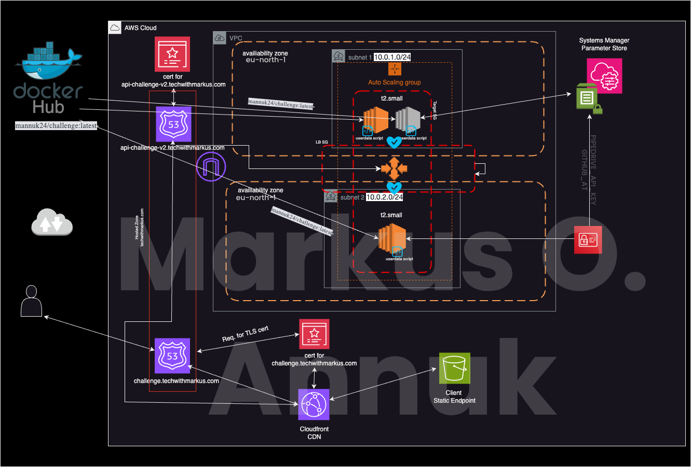

# Challenge PD

Hello! :)
I want to take a moment of your time to explain how this application works and how the whole infrastructure is built. 
I've divided this into 3 main sections:,
 
1) Infrastructure 

2) EC2 Startup scripts 

3) Application code 

4) Running the application locally 

I'll try to move from the outermost layer all the way to the logic of our application.

## 1. Infrastructure

The whole infrastructure for the API is written as code on <b>Terraform</b> for <b>AWS</b>. It consists of: 
• Hosted zones, records 
• IAM Roles, Policies, Attachments 
• Systems Manager Parameter Store as secure storage for the Pipedrive API key and Github Access Token 
• ACM Certs for AWS managed services (Application Load Balancer, Cloudfront CDN), Certbot on individual machines 
• VPC, Subnets, Security Groups, ACLs. 
• Internet Gateway 
• Application Load Balancer 
• Auto Scaling Group 
• EC2 instances running the latest version of the docker image from DockerHub, served through NGINX 
 
So by applying the code written for the infrastructure (I know what you might be asking "Where is TDD for Infrastructure?!". Yes, for this project I decided not to.), we are provisioning all the necessary resources on AWS and automatically fetching the necessary env variables from <b>Parameter Store</b>setting up the <b>Docker containers</b>, <b>requesting TLS certs</b> and <b>configuring NGINX</b> with newly requested certs on all active EC2 machines.

So let's get into it..

I apologize for all the incoming "Once that is done"s, "Then"s and "Next"s.

It starts by creating the VPC with a CIDR block of 10.0.0.0/16.

Once that is done we are requesting certificates for both the load balancer (api-challenge.techwithmarkus.com) and Cloudfront (challenge.techwithmarkus.com).

Once that is done it validates the ACM Certificates through DNS by creating records in our hosted zone.

Next, we get the internet gateway up and running.

Once that is done, it procceeds with the creation of two subnets in two separate availability zones, us-east-1a & b (subnets.tf).

Next in line are two target groups, one intended for initial HTTP traffic for Certbot challenges and and the second one to serve all incoming application traffic. 

Next we are creating security groups for the target instances, which allow incoming connections from the load balancers security group. 

Now we have route tables and route tables associations with our subnets that we created earlier.

Once that is done, it moves on to creating our load balancer which forwards traffic to our 2 target groups depending on the rules. 

Next we create the launch template for our instances, currently I set them to run on t2.small Ubuntu 24.04 machines using the AMI ami-04b70fa74e45c3917.

Now it will be setting up the auto scaling group with a minimum amount of 1, desired amount of 2, and maximum amount of 3 instances spread across 2 availability zones (us-east-1a & b).

Once that is done, it updates the Route53 records for api-challenge.techwithmarkus.com to point to the IPv4 DNS of our Load Balancer.

Almost done! Now all that it has left to do is create the listeners for the load balancer (2).
 

## 2. Startup script on EC2 machines

Alright, so now that all resources are launched on AWS we have to have a way for the EC2 machine that are in the target groups, be able to serve our application. For that I've written a userdata script that each newly launched machine executes. I'll give you a quick explanation of what each part of it does :).

So it starts off by sleeping for 90 seconds, this pretty much gives enough time for the target groups and load balancer to finish configuring, otherwise we cannot respond to certbot challenges which sends a request which is eventually forwarded to the load balancer. So we need the load balancer to be in working order by that time. We can tweak it, currently set at 90 sec.

So next what we do is install the aws cli.

Once that is done we send requests to Systems Manager Parameter Store to get access to the Pipedrive API key and Github Access token, we query just the value and then echo them into envfile.env which we eventually will be passing into the docker container.

Then what it does, is it downloads package info from configured sources.

Next we install Certbot, Nginx, and Docker.

Now we start a new bash shell to insert a server configuration for NGINX. All it pretty much does is it tells the server to listen on port 80 (we will need this for the certbot challenge request).

After that is done we reload & start nginx. Now we are able to requests certs from certbot.

Moving on, we write a one-liner to request certificates for api-challenge.techwithmarkus.com in non interactive mode, and we insert all the necessary details beforehand (like the agreement to tos and our email)

Now we start another shell to insert a new :443 listner into our NGINX configuration, provide it the certificates that certbot issued and tell it to forward traffic to the container port of the Docker container that we will be running shortly.

Now we will reload nginx for the changes to take effect.

Just in case we will make sure there is no matching container running (if there is we stop and remove it).

Next, we will pull the latest docker image of mannuk24/challenge from DockerHub with auto-restart enabled only in case of an error exit, pass it the environment file that we created earlier and run it, exposing port 8050.